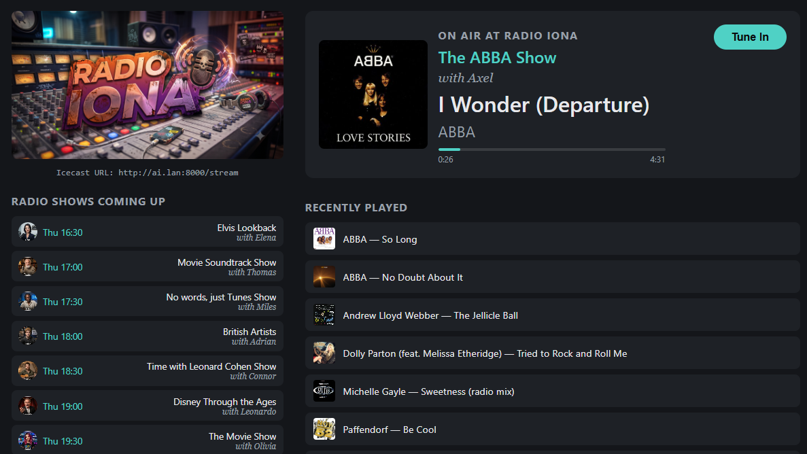
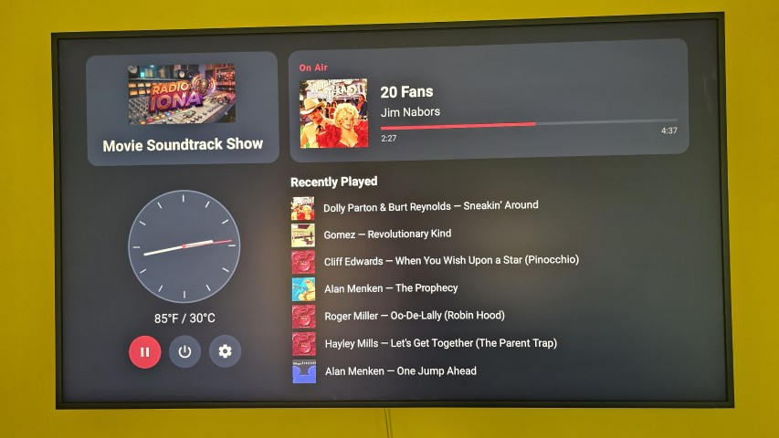

# Radio Clyde

A self-hosted AI DJ internet radio station: a real, continuous Icecast
stream running on a schedule you define, with a weekly lineup of shows,
each backed by its own tracklist pulled from your Plex library, its own
AI-written DJ script, and its own synthesized DJ voice. When nothing's
scheduled, it falls back to shuffled library filler instead of going quiet.

Tune in however you like: the raw Icecast stream in any player, a clean web
now-playing page in the browser, a native Google TV app built for the
living room, or a native Android phone/tablet app for listening on the go.

Nothing here is a hosted service or SaaS: it's orchestration code you run
against your own Plex server, your own local LLM, and your own TTS engine,
described in more depth below.

  
  

## What it does

A single long-running scheduler daemon watches the clock and, for every
upcoming show occurrence, runs two phases:

1. **Produce**: turns a show's prose brief (`show-descriptions/*.md`, see
   [sample-data/](sample-data/) for real examples) into a validated
   `.script.md`. Resolves the brief into a real Plex query, picks tracks,
   researches facts about them, and writes every DJ line.
2. **Direct**: turns that finished script into real broadcast assets.
   Synthesizes and caches the DJ audio, resolves any live segments (time,
   weather) fresh, and assembles the playlist Liquidsoap actually plays.

Everything ahead of air time can also be **prewarmed**: during a
configurable daily downtime window, the scheduler widens its horizon and
produces/directs the *whole* upcoming broadcast day at once, front-loading
the heavy LLM/TTS work onto the hours nobody's listening rather than doing
it just-in-time.

See [docs/producer-pipeline.md](docs/producer-pipeline.md) for why this is
built as a multi-phase pipeline rather than one open-ended agent loop, and
[script-format.md](script-format.md) for the `.script.md` grammar the two
phases hand off through.

## Features

- **Scheduled shows, not a static playlist**: a weekly `station.json`
  lineup, each slot backed by a plain-prose brief (artist/genre/decade,
  exclusions, repeat rules, popularity weighting, max track length; details
  below) resolved against your actual Plex library.
- **AI-written scripts with real research**: every DJ line is written
  against real track/artist facts pulled from Wikipedia, not generic filler,
  so the DJ can drop genuinely useful trivia about the artist or track
  playing next, or turn it into a quiz for listeners before the track
  starts. A final editing pass catches repeated phrasing across a script no
  single writing step could see all at once.
- **Distinct synthesized DJ personas**: each show picks a persona
  (voice + system prompt); speech is synthesized and cached via Chatterbox.
- **Live segments resolved fresh**: time/weather call-ins are generated at
  broadcast time using real current conditions from the Open-Meteo weather
  API, not baked in ahead of time, so they're never stale.
- **Continuous stream with graceful fallback**: Liquidsoap plays the
  directed show when one's on; the moment nothing's scheduled or directed
  yet, it falls back to a shuffled, regenerating filler pool instead of
  going silent.
- **Downtime prewarming**: a configurable daily quiet window where the
  whole next day's scripts and DJ audio get produced ahead of time.
- **Web now-playing page + JSON API**: now playing, recently played
  history, and upcoming shows, plus an authenticated stream proxy.
- **Native Android TV / Google TV app**: a Leanback client for the same API
  (now-playing card, live clock/weather, playback controls, history).
- **Native Android phone/tablet app**: a touch client for the same API, with
  two switchable server profiles (home network vs. away) that auto-select by
  reachability, so the same app works whether you're on the station's LAN or
  out and about.
- **Plex scrobbling**: actual airplay updates Plex's own play count/history,
  gated on real listener count so airtime to nobody doesn't inflate it.
- **Production-ready as a systemd service**: unit files for the scheduler
  daemon and the web server.

## Meet the DJs

Each persona has its own photo, shown alongside its voice in the web
now-playing page and the Google TV app.

<table>
<tr>
<td align="center"> Abigail</td>
<td align="center"> Adrian</td>
<td align="center"> Alexander</td>
<td align="center"> Alice</td>
<td align="center"> Austin</td>
<td align="center"> Axel</td>
<td align="center"> Connor</td>
</tr>
<tr>
<td align="center"> Cora</td>
<td align="center"> Elena</td>
<td align="center"> Eli</td>
<td align="center"> Emily</td>
<td align="center"> Everett</td>
<td align="center"> Gabriel</td>
<td align="center"> Gianna</td>
</tr>
<tr>
<td align="center"> Henry</td>
<td align="center"> Ian</td>
<td align="center"> Jade</td>
<td align="center"> Jeremiah</td>
<td align="center"> Jordan</td>
<td align="center"> Julian</td>
<td align="center"> Layla</td>
</tr>
<tr>
<td align="center"> Leonardo</td>
<td align="center"> Michael</td>
<td align="center"> Miles</td>
<td align="center"> Olivia</td>
<td align="center"> Ryan</td>
<td align="center"> Taylor</td>
<td align="center"> Thomas</td>
</tr>
</table>

## Components

| Component | Role |
|---|---|
| **Node.js** (this repo) | Orchestration: scheduling, script production, directing, the web server/API |
| **Plex Media Server** | Music library backend: track/artist/album metadata and search |
| **LM Studio** (or any OpenAI-compatible endpoint) | Local LLM: track-query resolution, script writing, script editing, live-segment lines |
| **Chatterbox** | Text-to-speech engine: synthesizes each persona's DJ audio |
| **Liquidsoap** | Playout engine: plays the directed playlist or falls back to filler, feeds Icecast |
| **Icecast** | The actual stream server listeners connect to |
| **Fastify** | Web server: now-playing page, JSON API, authenticated stream proxy |
| **Android TV / Google TV app** (`android-tv/`) | Native Java/Leanback client, independent Gradle project |
| **Android mobile app** (`android-mobile/`) | Native Java/Material phone-tablet client, independent Gradle project |

## Setup

1. `npm install`
2. Copy `config.example.json` to `config.json` and fill in real values
   (Plex token, Icecast credentials, LM Studio/Chatterbox URLs, personas,
   etc.). `config.json` is gitignored since it holds secrets.
3. Point `dataDir` in `config.json` at wherever `station.json`,
   `show-descriptions/*.md`, and all generated output should live. This is
   deliberately kept outside the repo. See [sample-data/](sample-data/) for a
   working example to copy as a starting point.
4. Run the scheduler (`npm run runstation`, or install
   `radioclyde-scheduler.service` via systemd for production).

## Writing a show's Track Selection brief

Each `show-descriptions/*.md` file has a `## Track Selection` section: plain
prose, not a config format. It's read by `src/producer/trackSelection/query.js`,
which uses an LLM to turn it into a structured Plex query
(`src/producer/trackSelection/queue.js` then runs that query, no AI
involved past this one step). Things you can
say there:

- **Artist / genre / decade**: at least one is required (unless using album
  keyword, below). Genre gets matched to the closest real tag in this Plex
  library (you don't need to know Plex's internal tag names; "80s rock"
  resolves to whatever this library actually calls it, e.g. "Pop/Rock"). All
  three can combine (e.g. genre + decade).
- **Album keyword**: for a brief naming a compilation/branding rather than a
  real genre tag (e.g. "Disney", this library has no Disney genre, but does
  have albums titled things like "Ultimate Disney"), say so directly (e.g.
  "only from albums with Disney in the title") and it matches by album-title
  substring instead.
- **Folder**: for a brief scoped to one specific library folder (e.g. "only
  from /volume1/media/_soundtrack"), name the path directly and it matches by
  filesystem path substring. Works with `singleAlbum` too: tracks under the
  folder get grouped by album title into pseudo-albums (folder-organized
  soundtrack libraries don't credit one consistent artist per album, so
  grouping is by title, not artist+title).
- **Album genre**: a separate, richer tag vocabulary from plain genre in
  this library (includes tags like "Instrumental" that don't exist at the
  track level at all). Say so explicitly (e.g. "use the album genre
  Classical") and it resolves via `albumGenre` instead of `genre`.
- **A theme spanning many named artists** (e.g. "female vocalists"): there's
  no such metadata in this library (only Genre/Country/artist/album/decade),
  so a brief like this gets resolved to a list of real artist names instead
  (`artistList`); whichever of those actually exist in the library get
  pooled together. Say the theme plainly in the brief and let the AI query
  step pick real, well-known artists who fit. It isn't scoped to a fixed
  vocabulary the way genre is, so results depend on the model's judgment.
- **Exclusions**: vague concepts are fine ("no christmas tracks", "nothing
  from soundtracks or compilation albums") and get expanded into concrete
  keyword matches against title/album/genre.
- **Repeat behavior**: "don't repeat the same artist" (meaningful for
  genre/decade shows; a no-op for single-artist shows, which repeat the
  artist by definition) or "spread across different albums" for a
  single-artist show that still wants catalog variety.
- **Popularity weighting**: "favor well-known tracks" biases toward more
  popular tracks without excluding deep cuts outright.
- **Max track length**: a plain cap, e.g. "no tracks over 5 minutes" or
  "radio edits only, under 3:30".

Iterate on a brief without touching `station.json` or waiting for the
scheduler using the preview tools below (`preview-tracks` is the fast one:
brief in, tracklist out).

## npm scripts

Pipeline (normally only invoked by the scheduler, not by hand):

- `npm run runstation`: the long-running daemon; owns every timing decision.
- `npm run generate-script -- --id=<showId>`: runs the producer for one show.
- `npm run direct-show -- --id=<showId> --weekday=<weekday> --date=<yyyy-mm-dd> --time=<HH:MM>`: runs the director for one occurrence.
- `npm run prewarm-show-audio -- --id=<showId> [--weekday=<weekday> --date=<yyyy-mm-dd>]`: warms a show's dj-audio cache ahead of time (the downtime job's own per-show step).
- `npm run update-now-playing`: points `now_playing.m3u` at whatever should be airing.
- `npm run generate-filler-playlist`: rewrites the off-air filler pool.
- `npm run runweb`: the web server (now-playing page, JSON API, stream proxy).

Preview/dry-run tools, for iterating on a show while designing it (no
station.json entry required):

- `npm run preview-tracks -- <show-name>`: the fast one. Resolves
  `show-descriptions/<show-name>.md`, pulls its `## Track Selection` text
  and `**Duration:**`, and prints the AI-produced Plex query plus the
  resulting tracklist. Also accepts a full/relative path, or
  `--text="<brief>" --duration=<minutes>` for a brief with no file at all.
  (`preview-track-query-ai` is the same script, longer name.)
- `npm run preview-track-queue -- --duration=<minutes> [--artist=... --genre=... --decade=...]`: the deterministic track-selection step directly, bypassing the AI query-producing step entirely.
- `npm run preview-show-prep -- --file=<path> --duration=<minutes>`: the fuller show-prep dry run (track query + research), still short of full script writing.

## Documentation

- [sample-data/](sample-data/): a working example `dataDir`, a full
  `station.json` and a real set of `show-descriptions/*.md` briefs.
- [script-format.md](script-format.md): the `.script.md` output grammar
  the director consumes mechanically to produce broadcast assets.
- [docs/producer-pipeline.md](docs/producer-pipeline.md): architecture of
  the track-selection + research + script-writing pipeline. What each stage
  does, why it's split the way it is, and what's still open.
- [docs/plex-library-notes.md](docs/plex-library-notes.md): empirical
  facts about Plex's API behavior, confirmed live rather than assumed from
  Plex's general docs.
- [docs/android-tv-app.md](docs/android-tv-app.md): architecture of the
  native Android TV/Google TV client. Package layout, the backend API it
  consumes, key design decisions.
- [docs/android-mobile.md](docs/android-mobile.md): architecture of the
  native Android phone/tablet client. What's different from the TV app
  (touch UI, no clock/weather, the dual server-profile auto-reachability
  design), package layout, key design decisions.
